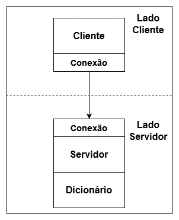

# Laboratório 2 - Sistemas Distribuídos 2023.1

## Atividade 1

### Estilo arquitetural

Decidi utilizar o estilo arquitetural de camada com 4 componentes, sendo que um desses componentes serve como uma ponte de comunicação entre os lados do cliente e do servidor. Cada componente será implementado em uma classe do python. 

### Componentes

Lista dos componentes e suas funcionalidades na ordem da camada mais acima até a mais abaixo:

* **Cliente:** Implementa a interface de usuário e envia requisições para o lado do servidor através do componente Socket.
* **Conexão:** Encapsula todo o código para enviar e receber mensagens através de um socket de rede.
* **Servidor:** Recebe e processa as requisições do cliente e envia respostas com os valores do dicionário. Também implementa uma interface para o administrador do servidor.
* **Dicionário:** Implementa o acesso, a remoção e a edição do dicionário assim como a leitura e escrita do arquivo que armazena o dicionário.

## Atividade 2

O lado cliente fica com o componente Cliente enquanto o lado servidor fica com os componentes Servidor e Dicionário. O componente Conexão fica presente em ambos os lados, como é demonstrado no diagrama abaixo.

### Diagrama

### Mensagens
